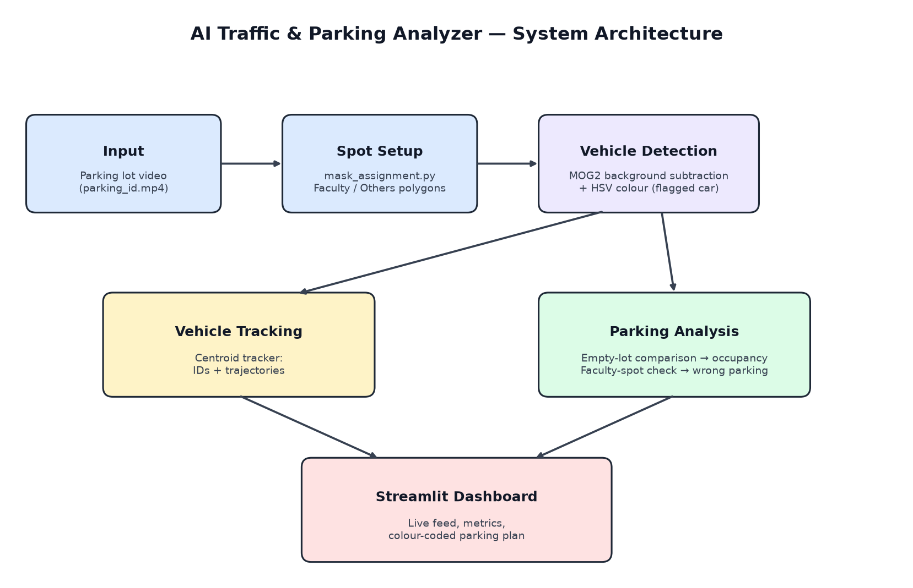
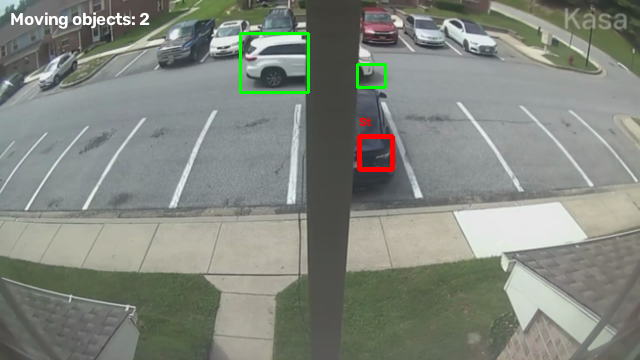
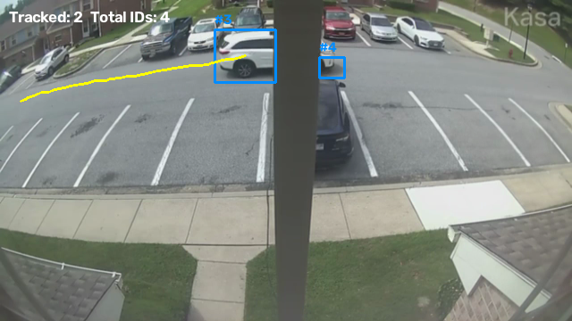
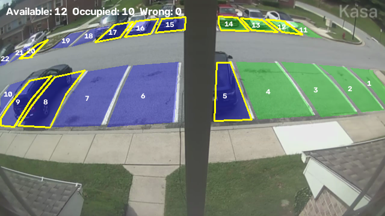

# 🚗 AI Traffic & Parking Analyzer

A computer vision system that watches a parking lot camera feed, **detects** and **tracks** vehicles, shows which parking spaces are **available or occupied**, and flags **wrong parking** in reserved Faculty spaces, all on a live Streamlit dashboard.


> 🔒 **This is a project showcase.** The source code is kept in a private repository. Contact me through [GitHub](https://github.com/Awotwi-Baf) if you'd like to learn more or see a demo.

---

## 📌 Overview

- **Vehicle Detection**: finds moving vehicles with background subtraction (MOG2) and picks out a flagged car by colour.
- **Vehicle Tracking**: gives each moving vehicle an ID and draws its path with a centroid tracker.
- **Parking Analysis**: compares each of the 22 parking spaces with an image of the empty lot to decide if it is occupied, and flags the flagged car parked in a Faculty space.
- **Dashboard**: a Streamlit app that shows the live feed, Available / Occupied / Wrong Parking / Total counts, and a colour-coded parking plan.

## 🏗️ System Architecture



A full write-up is in [docs/project_overview.pdf](docs/project_overview.pdf).

## 📸 Results

| Vehicle Detection | Vehicle Tracking | Parking Analysis |
|:---:|:---:|:---:|
|  |  |  |
| Moving vehicles (green) and the flagged car (red) | Vehicle IDs with trajectories | Green = Faculty, blue = Others, yellow outline = occupied |

## 🧠 How It Works

| Stage | Technique |
|---|---|
| Spot setup | Hand-drawn polygons labelled Faculty / Others, saved as JSON |
| Detection | MOG2 background subtraction; HSV colour threshold for the flagged car |
| Tracking | Centroid tracker matches detections frame to frame |
| Occupancy | A space is occupied when ≥ 50% of its pixels differ from the empty-lot image |
| Wrong parking | The flagged car covering ≥ 30% of a Faculty space |
| Auto spot detection | White-line thresholding + morphology, spaces built between neighbouring lines |

## 📂 Project Structure

```
ai-traffic-parking-analyzer/
│
├── README.md
│
├── docs/
│   ├── system_architecture.png
│   └── project_overview.pdf
│
├── examples/
│   └── screenshots/
│       ├── vehicle_detection.png
│       ├── vehicle_tracking.png
│       └── parking_analysis.png
│
├── src/                        (private)
│   ├── vehicle_detection.py
│   ├── vehicle_tracking.py
│   └── parking_analysis.py
│
├── requirements.txt            (private)
│
└── LICENSE
```

## 🛠️ Tech Stack

Python · OpenCV · NumPy · Streamlit

## 🔮 Future Improvements

- Deep-learning vehicle detection (e.g. YOLO) for better accuracy in changing light
- Licence plate recognition to check which vehicles may use Faculty spaces
- Occupancy history and analytics
- Support for multiple cameras

## 📄 License

© 2026 Awotwi-Baf. All rights reserved. See [LICENSE](LICENSE).

## 👤 Author

**Awotwi-Baf** · [GitHub](https://github.com/Awotwi-Baf)
